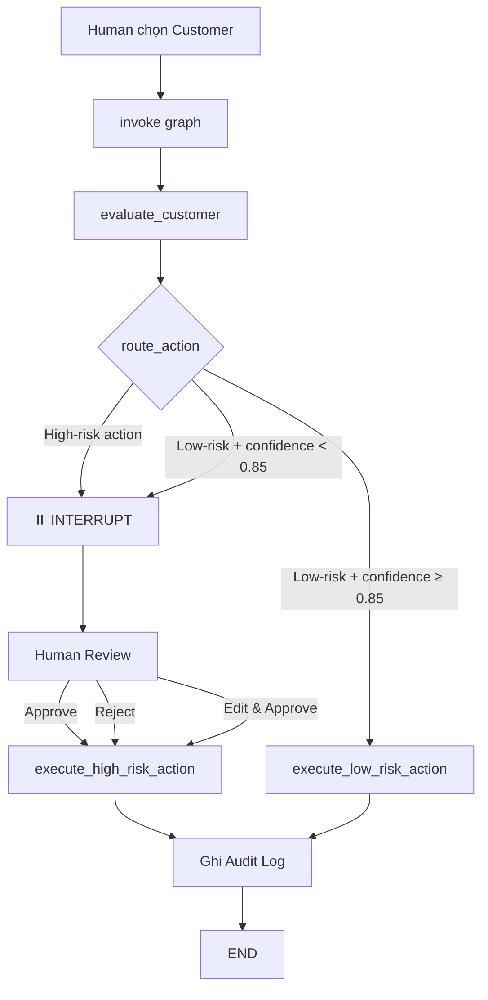

# 🛡️ Human-in-the-Loop (HITL) Approval System

> **Day 27 — Lab 27** | AI thực chiến Track 3  
> **MSSV:** 2A202601046 — **Nguyễn Đình Duy**

Hệ thống **Human-in-the-Loop** cho phép con người review và phê duyệt các quyết định high-risk của AI Agent trước khi thực thi, được xây dựng bằng **LangGraph** (stateful workflow + interrupt) và **Streamlit** (giao diện dashboard).

---

## 📋 Mục lục

- [Tổng quan](#-tổng-quan)
- [Kiến trúc hệ thống](#-kiến-trúc-hệ-thống)
- [Tính năng](#-tính-năng)
- [Công nghệ sử dụng](#-công-nghệ-sử-dụng)
- [Cài đặt & Chạy](#-cài-đặt--chạy)
- [Cấu trúc dự án](#-cấu-trúc-dự-án)
- [Luồng hoạt động chi tiết](#-luồng-hoạt-động-chi-tiết)
- [Routing Rules](#-routing-rules)
- [Demo sử dụng](#-demo-sử-dụng)

---

## 🎯 Tổng quan

Trong các hệ thống AI thực tế, không phải mọi quyết định đều nên được thực thi tự động. Những hành động **high-risk** (ví dụ: tăng hạn mức tín dụng) cần có sự **kiểm duyệt của con người** trước khi thực thi.

Dự án này minh hoạ mô hình HITL với kịch bản:
- **Agent** phân tích dữ liệu khách hàng (TOI, churn probability) và đề xuất hành động
- Hành động **low-risk** với confidence cao → **tự động thực thi**
- Hành động **high-risk** hoặc confidence thấp → **dừng lại (interrupt)** và chờ human review
- Human có thể **Approve**, **Reject**, hoặc **Edit & Approve**
- Mọi quyết định đều được ghi vào **Audit Log**

---

## 🏗️ Kiến trúc hệ thống

```
┌──────────────┐
│   Streamlit  │   ← Giao diện dashboard cho human operator
│   (app.py)   │
└──────┬───────┘
       │ invoke / resume
       ▼
┌──────────────────────────────────────────────────┐
│              LangGraph Workflow (graph.py)        │
│                                                  │
│  ┌──────────────────┐                            │
│  │ evaluate_customer │  ← Agent reasoning node   │
│  └────────┬─────────┘                            │
│           │                                      │
│     route_action()   ← Conditional routing       │
│      ┌────┴────┐                                 │
│      ▼         ▼                                 │
│  ┌────────┐ ┌─────────────────────┐              │
│  │Low-Risk│ │ ⏸️ INTERRUPT          │              │
│  │  Auto  │ │ High-Risk            │              │
│  │Execute │ │ (chờ human decision) │              │
│  └────┬───┘ └──────────┬──────────┘              │
│       │                │                         │
│       ▼                ▼                         │
│     [END]           [END]                        │
│                                                  │
│  📝 MemorySaver (checkpointer)                   │
└──────────────────────────────────────────────────┘
       │
       ▼
┌──────────────┐
│ audit_log.json│  ← Audit trail (Pydantic schema)
└──────────────┘
```

---

## ✨ Tính năng

| Tính năng | Mô tả |
|-----------|-------|
| **Agent Reasoning** | Giả lập đánh giá TOI và churn probability để đề xuất hành động |
| **Confidence Routing** | Tự động phân luồng dựa trên confidence score và loại action |
| **Interrupt & Resume** | LangGraph `interrupt_before` dừng workflow trước node high-risk |
| **3 Human Actions** | Approve ✅ · Reject ❌ · Edit & Approve ✏️ |
| **Audit Trail** | Ghi log mọi quyết định vào `audit_log.json` với Pydantic schema |
| **Confidence Meter** | Hiển thị trực quan confidence score với progress bar và metric |
| **Action Card** | Colour-coded card (🔴 high-risk / 🟢 low-risk / 🟡 low confidence) |
| **Mock Data** | 3 customer profiles + 1 unknown customer để test các scenario |

---

## 🛠️ Công nghệ sử dụng

| Thành phần | Công nghệ |
|------------|-----------|
| Workflow Engine | [LangGraph](https://github.com/langchain-ai/langgraph) (StateGraph, MemorySaver, interrupt) |
| UI Dashboard | [Streamlit](https://streamlit.io/) |
| Data Validation | [Pydantic](https://docs.pydantic.dev/) |
| Language | Python 3.10+ |

---

## 🚀 Cài đặt & Chạy

### 1. Clone repository

```bash
git clone https://github.com/NgDuyyy/Day27-Lab27-Build-HITL-System-2A202601046-NguyenDinhDuy.git
cd Day27-Lab27-Build-HITL-System-2A202601046-NguyenDinhDuy
```

### 2. Cài đặt dependencies

```bash
pip install -r requirements.txt
```

### 3. Chạy ứng dụng

```bash
streamlit run app.py
```

Mở trình duyệt tại **http://localhost:8501** để sử dụng dashboard.

---

## 📁 Cấu trúc dự án

```
Day27-Lab27-Build-HITL-System/
├── app.py              # Streamlit UI — dashboard cho human operator
├── graph.py            # LangGraph workflow — agent reasoning, routing, execution
├── models.py           # Pydantic schema — AuditEntry cho audit trail
├── requirements.txt    # Dependencies
├── audit_log.json      # Audit log (tự động tạo khi chạy)
├── LabGuide.md         # Hướng dẫn lab
├── check.md            # Checklist kiểm tra
└── README.md           # Tài liệu dự án (file này)
```

### Mô tả chi tiết

#### `graph.py`
- **`GraphState`** — TypedDict lưu trạng thái xuyên suốt workflow: `customer_id`, `proposed_action`, `confidence_score`, `reasoning`, `human_decision`
- **`evaluate_customer()`** — Node giả lập agent reasoning, phân tích TOI và churn probability
- **`route_action()`** — Conditional edge function với 3 routing rules
- **`execute_low_risk_action()`** — Auto-execute và ghi audit log
- **`execute_high_risk_action()`** — Kiểm tra human decision trước khi thực thi
- **`build_graph()`** — Compile StateGraph với `MemorySaver` + `interrupt_before`

#### `app.py`
- Sidebar: chọn customer và trigger evaluation
- Main area: hiển thị agent reasoning, confidence meter, action card
- Human review panel: 3 nút Approve/Reject/Edit khi graph bị interrupt
- Audit log viewer: bảng hiển thị lịch sử quyết định

#### `models.py`
- **`AuditEntry`** — Pydantic BaseModel ghi lại: `timestamp`, `agent_id`, `action`, `confidence`, `reviewer_id`, `decision`

---

## 🔄 Luồng hoạt động chi tiết



---

## 📏 Routing Rules

| Rule | Điều kiện | Kết quả |
|------|-----------|---------|
| **Rule 1 — Policy Override** | Action là `increase_credit_limit` | → Luôn interrupt, bất kể confidence |
| **Rule 2 — Auto-Execute** | Action low-risk + confidence ≥ 0.85 | → Tự động thực thi, không cần review |
| **Rule 3 — Escalate** | Action low-risk + confidence < 0.85 | → Interrupt, yêu cầu human review |

### Mock Customer Data

| Customer ID | Tên | TOI | Churn Prob | Tenure | Kết quả dự kiến |
|------------|-----|-----|------------|--------|-----------------|
| `CUST001` | Nguyen Van A | 150,000,000 VND | 0.7 (cao) | 36 tháng | 🔴 `increase_credit_limit` → Interrupt |
| `CUST002` | Tran Thi B | 50,000,000 VND | 0.3 (thấp) | 12 tháng | 🟢 `send_email` → Auto-execute |
| `CUST003` | Le Van C | 80,000,000 VND | 0.5 (trung bình) | 24 tháng | 🟡 `send_email` → Tuỳ confidence |
| `CUST_NEW` | — | — | — | — | 🟡 `send_email` → Tuỳ confidence |

---

## 🎮 Demo sử dụng

### Scenario 1: High-Risk → Human Approve
1. Chọn **CUST001** (churn cao + TOI cao)
2. Nhấn **🚀 Evaluate Customer**
3. Agent đề xuất `increase_credit_limit` → Graph **interrupt**
4. Nhấn **✅ Approve** → Action được thực thi, ghi audit log

### Scenario 2: Low-Risk → Auto-Execute
1. Chọn **CUST002** (churn thấp)
2. Nhấn **🚀 Evaluate Customer**
3. Agent đề xuất `send_email` với confidence cao → **Tự động thực thi**

### Scenario 3: Edit & Approve
1. Chọn **CUST001**
2. Nhấn **🚀 Evaluate Customer**
3. Sửa proposed action trong text input
4. Nhấn **✏️ Edit & Approve** → Action đã chỉnh sửa được thực thi

### Scenario 4: Reject
1. Chọn **CUST001**
2. Nhấn **🚀 Evaluate Customer**
3. Nhấn **❌ Reject** → Action bị huỷ, ghi audit log với decision = "reject"

---

## 📜 Audit Log

Mọi quyết định đều được lưu vào `audit_log.json` với format:

```json
{
  "timestamp": "2026-08-29T20:00:00.123456",
  "agent_id": "churn-risk-agent",
  "action": "increase_credit_limit",
  "confidence": 0.92,
  "reviewer_id": "operator_01",
  "decision": "approve"
}
```

Các giá trị `decision` có thể có:
- `auto_approved` — Low-risk, tự động thực thi
- `approve` — Human phê duyệt
- `reject` — Human từ chối
- `edit` — Human chỉnh sửa và phê duyệt

---

## 📄 License

Dự án này được phát triển cho mục đích học tập trong chương trình **AI thực chiến**.

---

<p align="center">
  Made with ❤️ by <strong>Nguyễn Đình Duy</strong> — 2A202601046
</p>
